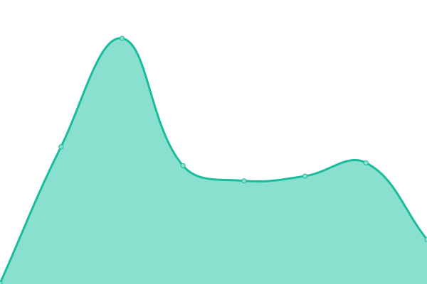
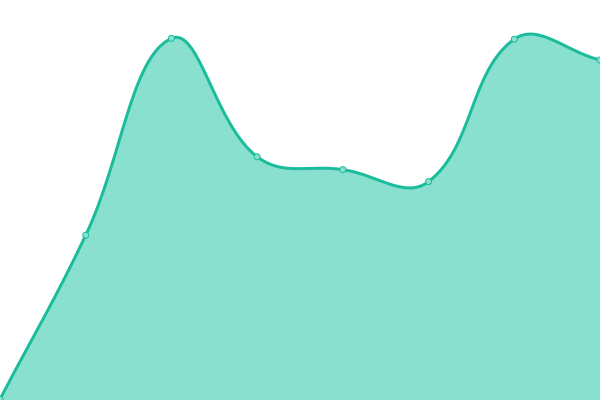
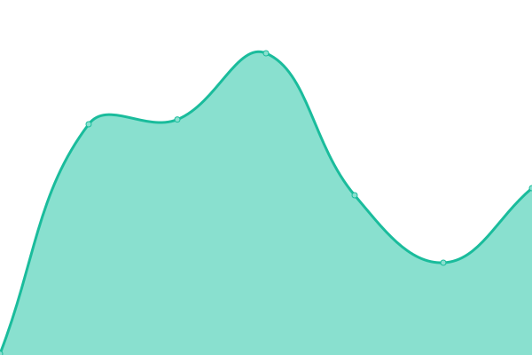
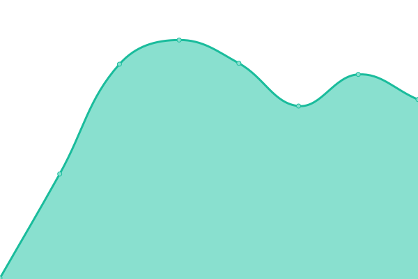
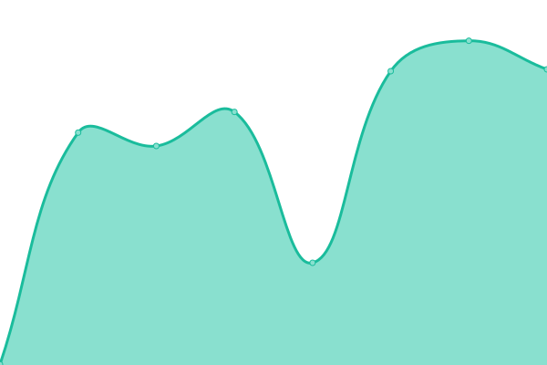
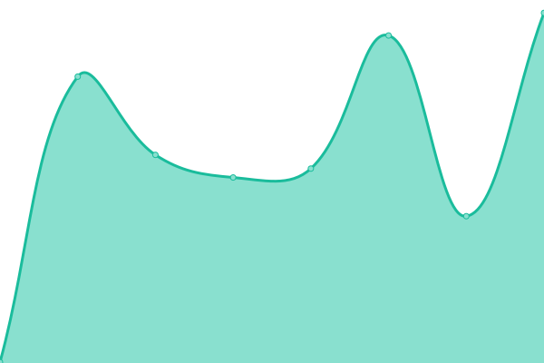
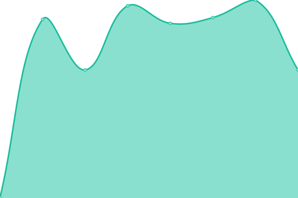

# [📈 Live Status](https://status.neurobagel.org): <!--live status--> **🟩 All systems operational**

This repository contains the open-source uptime monitor and status page for [Neurobagel](https://neurobagel.org/), powered by [Upptime](https://github.com/upptime/upptime).

With [Upptime](https://upptime.js.org), you can get your own unlimited and free uptime monitor and status page, powered entirely by a GitHub repository. We use [Issues](https://github.com/neurobagel/upptime/issues) as incident reports, [Actions](https://github.com/neurobagel/upptime/actions) as uptime monitors, and [Pages](https://status.neurobagel.org) for the status page.

<!--start: status pages-->
<!-- This summary is generated by Upptime (https://github.com/upptime/upptime) -->
<!-- Do not edit this manually, your changes will be overwritten -->
<!-- prettier-ignore -->
| URL | Status | History | Response Time | Uptime |
| --- | ------ | ------- | ------------- | ------ |
|  [Website (https://neurobagel.org/)](https://neurobagel.org/) | 🟩 Up | [website-https-neurobagel-org.yml](https://github.com/neurobagel/upptime/commits/HEAD/history/website-https-neurobagel-org.yml) | 

 174ms
     
 | 

<a href="https://status.neurobagel.org/history/website-https-neurobagel-org">100.00%</a>
    

|  [Public federation API (https://federate.neurobagel.org/)](https://federate.neurobagel.org/docs) | 🟩 Up | [public-federation-api-https-federate-neurobagel-org.yml](https://github.com/neurobagel/upptime/commits/HEAD/history/public-federation-api-https-federate-neurobagel-org.yml) | 

 306ms
     
 | 

<a href="https://status.neurobagel.org/history/public-federation-api-https-federate-neurobagel-org">100.00%</a>
    

|  [Public query tool (https://query.neurobagel.org/)](https://query.neurobagel.org/) | 🟩 Up | [public-query-tool-https-query-neurobagel-org.yml](https://github.com/neurobagel/upptime/commits/HEAD/history/public-query-tool-https-query-neurobagel-org.yml) | 

 188ms
     
 | 

<a href="https://status.neurobagel.org/history/public-query-tool-https-query-neurobagel-org">100.00%</a>
    

|  [Annotation tool (https://annotate.neurobagel.org/)](https://annotate.neurobagel.org/) | 🟩 Up | [annotation-tool-https-annotate-neurobagel-org.yml](https://github.com/neurobagel/upptime/commits/HEAD/history/annotation-tool-https-annotate-neurobagel-org.yml) | 

 189ms
     
 | 

<a href="https://status.neurobagel.org/history/annotation-tool-https-annotate-neurobagel-org">100.00%</a>
    

|  [Neurobagel OpenNeuro node (https://api.neurobagel.org/)](https://api.neurobagel.org/) | 🟩 Up | [neurobagel-open-neuro-node-https-api-neurobagel-org.yml](https://github.com/neurobagel/upptime/commits/HEAD/history/neurobagel-open-neuro-node-https-api-neurobagel-org.yml) | 

 311ms
     
 | 

<a href="https://status.neurobagel.org/history/neurobagel-open-neuro-node-https-api-neurobagel-org">100.00%</a>
    

|  [Neurobagel INDI node (https://indi.neurobagel.org/)](https://indi.neurobagel.org/) | 🟩 Up | [neurobagel-indi-node-https-indi-neurobagel-org.yml](https://github.com/neurobagel/upptime/commits/HEAD/history/neurobagel-indi-node-https-indi-neurobagel-org.yml) | 

 262ms
     
 | 

<a href="https://status.neurobagel.org/history/neurobagel-indi-node-https-indi-neurobagel-org">100.00%</a>
    

|  [Neurobagel QPN node](https://qpn.neurobagel.org/) | 🟩 Up | [neurobagel-qpn-node.yml](https://github.com/neurobagel/upptime/commits/HEAD/history/neurobagel-qpn-node.yml) | 

 301ms
     
 | 

<a href="https://status.neurobagel.org/history/neurobagel-qpn-node">100.00%</a>
    

|  [Digest dashboard](https://digest.neurobagel.org/) | 🟩 Up | [digest-dashboard.yml](https://github.com/neurobagel/upptime/commits/HEAD/history/digest-dashboard.yml) | 

 318ms
     
 | 

<a href="https://status.neurobagel.org/history/digest-dashboard">100.00%</a>
    

<!--end: status pages-->

[**Visit our status website →**](https://status.neurobagel.org)

## 📄 License

- Powered by: [Upptime](https://github.com/upptime/upptime)
- Code: [MIT](./LICENSE) © [Anand Chowdhary](https://anandchowdhary.com), supported by [Pabio](https://pabio.com)
- Data in the `./history` directory: [Open Database License](https://opendatacommons.org/licenses/odbl/1-0/)
